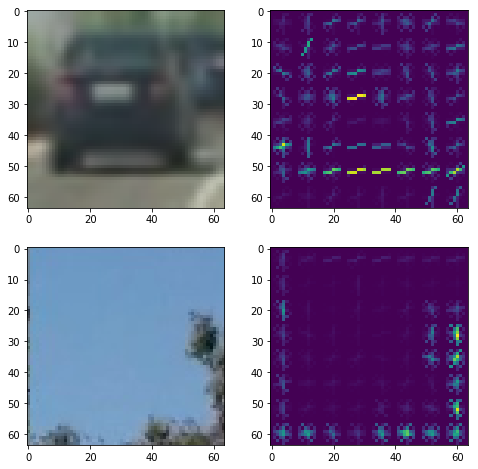
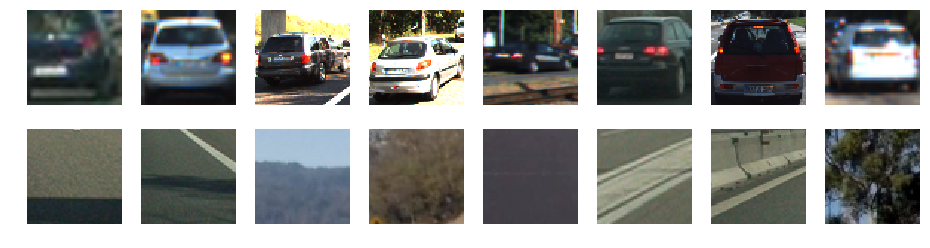
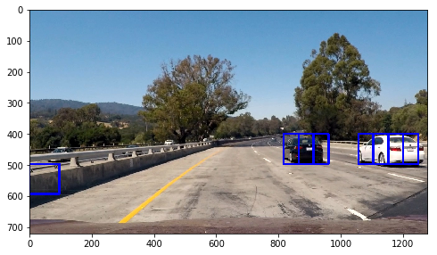
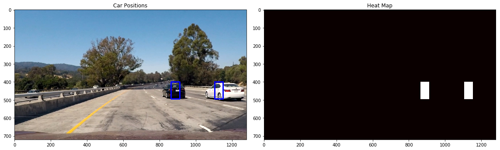
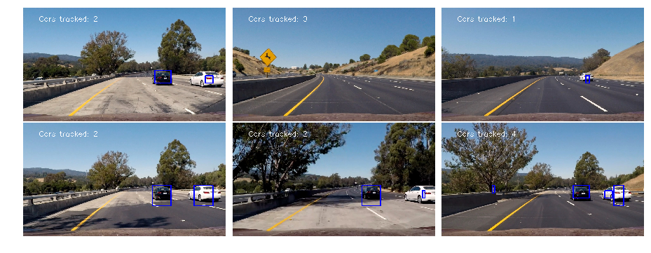

# Vehicle Detection

This project is part of the [Udacity Self-Driving Car Nanodegree Program](https://github.com/udacity/CarND-Vehicle-Detection). The goals / steps of this project are the following:

* Perform a Histogram of Oriented Gradients (HOG) feature extraction on a labeled training set of images and train a classifier (such as SVM).
* Optionally, apply a color transform and append binned color features, as well as histograms of color, to the HOG feature vector. 
* Implement a sliding-window technique and use the trained classifier to search for vehicles in images.
* Run the pipeline on a video stream to create a heat map of recurring detections frame by frame to reject outliers and follow detected vehicles.
* Estimate a bounding box for vehicles detected.

The main pipeline is in [vehicle_detection_pipeline.ipynb](vehicle_detection_pipeline.ipynb).

## 1. Extracting Histogram of Oriented Gradients and other features from an image

The first part of the project is to build a function to extract features from images. The main feature set we're interested in is the histogram of oriented gradients (HOG), which is essentially a weighted average orientation of patches of the image. To do this, I use the sklearn hog() function, with a wrapper in get_hog_features(). I have to choose various parameters of the HOG feature extraction, including the color space, number of channels, number of orientation bins, number of pixels per cell, and number of cells per block (over which the result is normalized). Here's an example of the HOG features for the parameters used in the class:

I also extract a color histogram and spatial color binning features in color_hist() and bin_spatial(), respectively (taken directly from the class material). These are complementary features to the HOG, because they're based primarily on color information rather than spatial information. The combination of these features should lead to a robust classifier.

## 2. Training a support vector machine classifier

I collect the various feature extraction routines in extract_features(), in order to train a classifier. After extracting them, I use StandardScalar() to scale the different types of features so one won't dominate the training. I used the provided training images (GTI, KITTI, and the extras) to train the classifer, splitting them into train and test sets using train_test_split(). Here's a visualization of the images, both cars and not cars:

Extracting the HOG, spatial bin, and color histogram features takes a different amount of time depending on the various parameters. Using these features, I train a linear support vector classifer (LinearSVC). Here are the results of my experiments with training the classifier using different parameters for the feature extraction (I used all channels in all cases, since this seemed to be necessary according to the discussion on the Slack channel):

| Color space | Orient. | Pix/cell | Feature len | Feat. time (s) | Class. time (s) | Accuracy |
|:-----------:|:-------:|:--------:|:-----------:|:--------------:|:---------------:|:--------:|
| RGB/All     | 9       | 8 	   | 5676	  	 | 147 s          | 22              | 0.9845   |
| HSV/All     | 9   	| 8 	   | 5676	  	 | 149 s          | 19              | 0.9885   |
| LUV/All     | 9       | 8 	   | 5676	  	 | 149 s          | 17              | 0.9916   |
| HLS/All     | 9       | 8 	   | 5676	  	 | 148 s          | 17              | 0.9896   |
| YUV/All     | 9       | 8 	   | 5676	  	 | 146 s          | 16              | 0.9916   |
| YCrCb/All   | 9       | 8        | 5676	  	 | 148 s          | 4               | 0.9896   |
| LUV/All     | 9       | 16 	   | 1356	  	 | 115 s          | 2               | 0.9879   |
| YUV/All     | 9       | 16 	   | 1356	  	 | 60  s          | 2               | 0.9870   |
| YUV/All     | 11      | 16 	   | 1572	  	 | 63  s          | 3               | 0.9901   |

The color spaces all appear to have almost the same feature extraction time, and result in nearly the same accuracy for the classifier. Since the LUV and YUV have marginally better accuracies, I also explored using an increased pixel per cell value, which dramatically reduces the training time, and slightly increasing the number of HOG orientations, which improves the accuracy. I ultimately decided to use YUV color space (all channels) with 11 orientations and 16 pixels per cell. 

## 3. Searching an image with a sliding window

Next, I set up utility functions to calculate the sliding window positions on an image, given a window size and overlap (slide_window); to draw the window boxes on an image (draw_boxes); to extract the features for a single image (single_img_features); and to extract features for each window in an image, and use the classifier to make a prediction in that window (search_windows). These are basically all taken from the class materials. Here's what the result looks like for a test image:

It's a good result, with accurate detections around the two cars and only one false positive. To improve it, I implemented both multi-scale windows, and the HOG pre-calculation trick, in find_cars(). This handles detecting cars using sliding windows at adjustable scale (mostly using code taken from the class materials). To speed up the HOG calculation, it also calculates HOG features once for the entire image, and then for each new position of the sliding window it simply looks them up, rather than re-calculating them (far more efficient given the window overlap). 

## 4. Heat maps and labeling cars

The detection pipeline produces both false positives and multiple detections for each car. To handle this, I define utility functions to build and threshold heat maps based on the detected windows. The basic idea is to assign one "heat" point for every pixel within a detection window, threshold this to remove outliers/false positives, and then label the resulting clusters. These utilty functions are mostly taken from class materials. The labeling step is handled by scipy's label() function, and the function draw_labeled_bboxes() then extracts a bounding box to cover the full pixel range of each cluster that is labeled. The result for a single test image looks like this:

## 5. Handling video

With video input, we can use time information to improve the vehicle identification - real detections will persist from frame to frame, while false positives will be more transient. To handle this, I create the vehicleDetection() class, which remembers the bounding boxes of previous detections (up to a number of past frames set by the .memory attribute). It also holds two more parameters having to do with how much we rely on past frames: frame_decay and heat_threshold. Finally, it holds the estimated bounding box for each car after the labeling step (see below). 

To improve the detection of cars with different apparent sizes in the image, we have to examine various scales. I choose a set of scaling values from 0.75 to 3.0, and set corresponding vertical ranges to cover the likely areas of the image where vehicles of that relative size (due to perspective) are likely to appear. (For example, all of these exclude the sky and treetops!) This step was mostly trial-and-error, and was calculated to ensure that an integer number of windows (given a 0.5 overlap) fit in the region vertically. The full image pipeline is defined in process_image(). The result of this pipeline applied to the test images - without using the frame memory (i.e. a vehicleDetection() object with memory=1) - looks like this:

Finally, I applied the full pipeline to both the test video and the full project video; the result is [here](./output_video/video_output.mp4). This makes use of the vehicleDetection() class with a memory of 8 frames (determined empirically). For each frame, after the sliding windows are applied to detect cars (at multiple scales) the heat map is generated using the results of this and the seven previous frames. Each frame votes based on how old it is, with the highest vote coming from the current frame, and older frames decaying exponentially with a ratio set by frame_decay (I used 0.8). The heat map is then thresholded with a value set by heat_threshold (I used 3) to remove false positives. The idea is to rely somewhat on previous frames to track real detections, but not to rely so much on previous frames that the system fails to detect the relative motion of vehicles in each new frame.

The thresholded heat map is then labeled using scipy's label() function, and the resulting labels are processed by the vehicleDetection() class function update_tracking(). This calculates the bounding box around each labeled region, and then takes a weighted average with bounding boxes from previous frames. If the number of labeled regions remains constant (i.e. the number of detected cars doesn't change) then this is straightforward, and the bounding box position updates smoothly. If the number of labeled regions changes, the function resets the list of bounding boxes with the ones from the current frame. (In a future version of this project, I would like to implement better persistence for this situation.) 

## 6. Discussion

1. There are lots of parameters that could still be tuned in this pipeline, including different choices for the detection scales and their relative regions of interest, and the "memory" of previous frames. The pipeline runs slowly, so it's hard to test these empirically. However, improving the pipeline speed seems difficult without reducing the fidelity of the extracted features, and degrading the classiifer accuracy.

2. Other students seem to have done well reducing false positives using additional training data, including the new Udacity data set. In a future version of the project, I'd like to add that to the training step, to improve the performance of the classifier.

3. Several students have experimented with neural network methods, including YOLO. These seem to have many advantages over the features + sliding window + heat map approach used here, and it would be interesting to explore them more.

